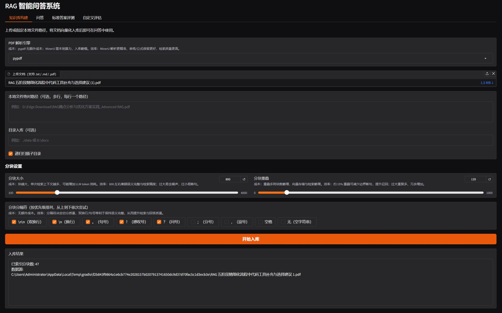
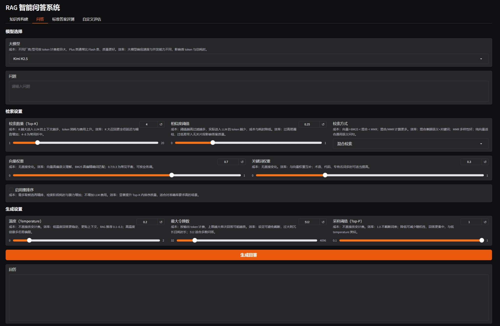
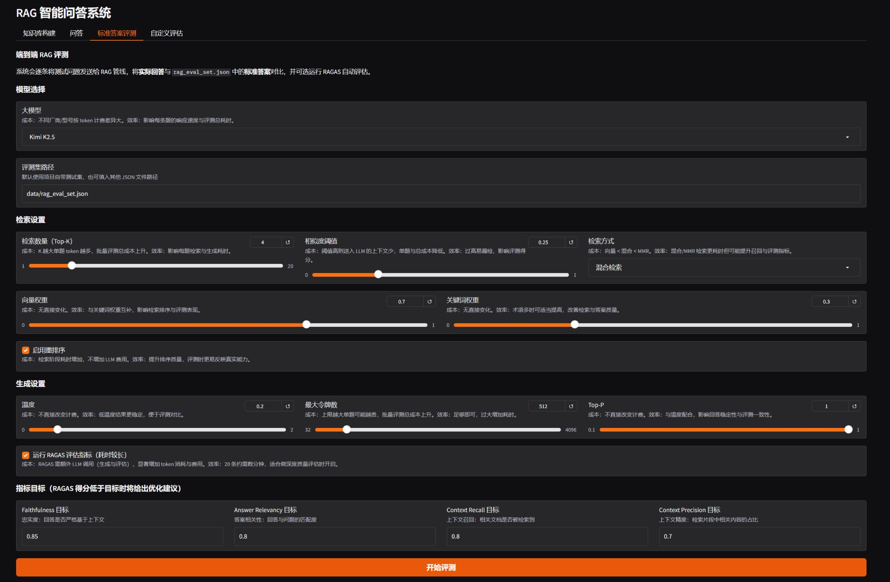
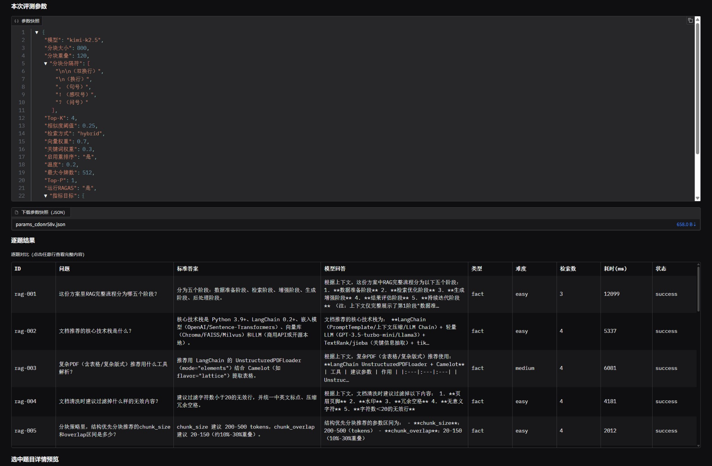
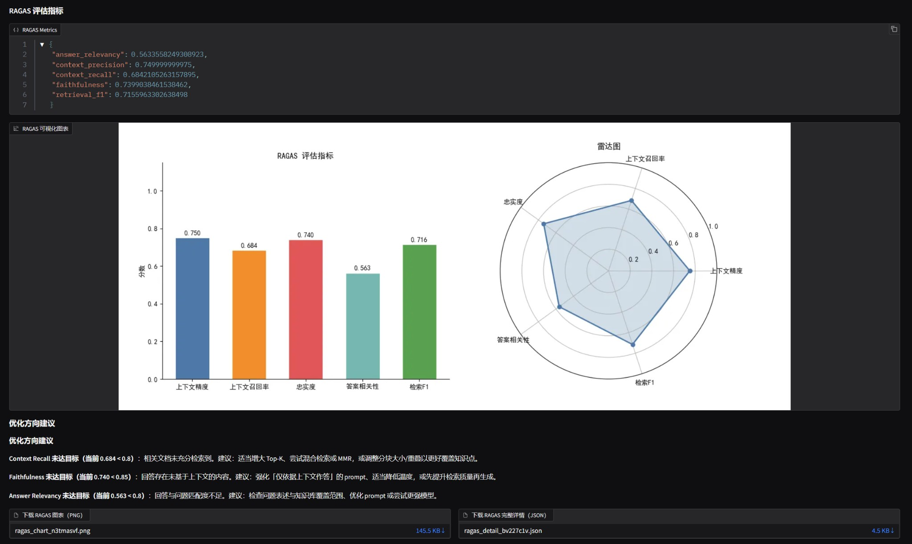
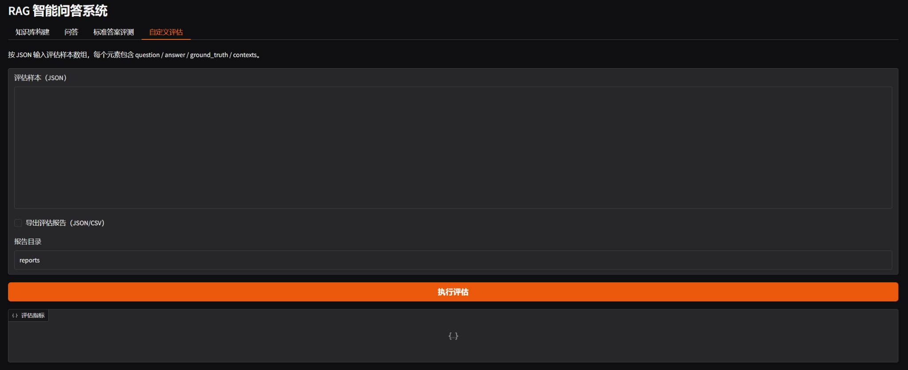

# RAG Web System

> **📌 浏览者提示**：下方「功能/界面预览」为本系统四大模块的截图，建议先浏览以快速了解界面与能力。  
> **GitHub 仓库简介建议**：在仓库 About 中可填写：「RAG 全链路可调参框架 · FastAPI+Gradio+LangChain · 建议先看 README 功能/界面预览」

一套面向 **RAG 应用开发者**的完整开发框架，基于 **FastAPI + Gradio + LangChain 1.0+** 构建，迭代版本 **v0.4.1**。

目标是让开发者在面对不同子项目时，能**快速进行针对性调优**，大幅提升迭代效率。

---

## 功能/界面预览

以下为 Gradio 界面各 Tab 的预览，便于快速了解系统能力与调参入口。

| 模块 | 说明 |
|------|------|
| **知识库构建** | 上传/路径/目录入库，分块与分隔符配置，PDF 解析引擎选择 |
| **问答** | 大模型选择、检索方式（Top-K/阈值/混合/重排序）、生成参数（温度/最大 token/Top-P） |
| **标准答案评测** | 端到端评测配置、指标目标（Faithfulness / Answer Relevancy / Context Recall / Context Precision）、RAGAS 开关 |
| **评测结果与优化建议** | 参数快照、逐题结果、RAGAS 指标与图表、低于目标时的优化方向建议 |
| **自定义评估** | JSON 输入评估样本，导出报告（JSON/CSV） |



*图 1：知识库构建 — 文档上传、分块设置与入库结果*



*图 2：问答 — 模型选择、检索与生成参数*



*图 3：标准答案评测 — 评测集路径、检索/生成设置与指标目标*



*图 4：评测参数快照与逐题对比结果*



*图 5：RAGAS 评估指标、可视化图表与未达目标时的优化方向建议*



*图 6：自定义评估 — JSON 样本输入与报告导出*

---

## 核心功能

- **完整 RAG 流程**：文档上传、检索、问答一站式完成
- **自动化评估**：基于测试集 + RAGAS 的系统化评估，支持逐题分析与可视化
- **可配置指标目标**：Faithfulness / Answer Relevancy / Context Recall / Context Precision 默认 0.85 / 0.8 / 0.8 / 0.7，低于目标时自动给出优化建议
- **全链路可调参**：所有关键模块均支持参数调节，参数旁有成本/效率说明浮窗，调参结果可保存
- **仅答知识库**：模型仅依据上下文作答，无上下文时不调用 LLM，避免 API 滥用
- **多模型支持**：内置多种 LLM 可供切换，运行时动态选择
- **主流 RAG 优化方法覆盖**：向量检索、BM25、混合检索、MMR、Reranker 重排序等
- **评估结果可视化**：RAGAS 指标图表与未达目标时的优化方向建议，方便直观查看效果与后续调优

## 版本迭代记录

### v0.4.1（当前版本）

- **安全与配置**
  - 新增 `APP_API_TOKEN` 鉴权开关，支持受保护接口访问
  - 新增 `REPORTS_DIR`，并限制评估报告导出目录范围
  - 异常返回信息收敛，减少内部细节泄露风险
- **稳定性与可维护性**
  - `RAGPipeline` 缓存改为线程安全读写
  - `main.py` 服务初始化重构为 FastAPI lifespan 管理
  - Docker 构建流程优化，避免 editable 安装时序问题
- **检索与生成**
  - 修复 `score_threshold=0.0` 与 `chunk_overlap=0` 的边界行为
  - 生成器模型缓存实现优化，错误消息统一中文
  - 启动脚本默认安装 reranker 依赖，重排序开箱可用
- **评估与测试**
  - RAGAS 在无评估模型配置时返回 `skipped`，避免直接报错
  - 测试桩签名与兼容性修复，当前测试通过（`4 passed`）

### v0.4（历史版本）

- 首个公开版本，提供 FastAPI + Gradio 全链路 RAG 系统
- 支持知识库构建、问答、标准答案评测与自定义评估

## 快速开始

```bash
python -m venv .venv
. .venv/Scripts/activate  # Windows PowerShell: .venv\Scripts\Activate.ps1
pip install -e .
copy .env.example .env
uvicorn app.main:app --host 127.0.0.1 --port 8000
```

访问：
- API 文档：`http://127.0.0.1:8000/docs`
- Gradio UI：`http://127.0.0.1:8000/ui`

## 目录结构

```text
app/
  core/         # 配置、日志、异常
  rag/          # 检索与生成核心逻辑
  eval/         # RAGAS 评估与优化建议
  web/          # Gradio 界面
  schemas/      # 接口数据模型
docs/preview/   # 功能/界面预览截图
tests/         # 单元与集成测试
```

## 配置说明

核心环境变量位于 `.env.example`：
- Embedding 本地模型：`EMBEDDING_MODEL_NAME`、`OLLAMA_BASE_URL`
- 向量库持久化路径：`VECTOR_STORE_DIR`
- LLM API：`LLM_BASE_URL`、`LLM_API_KEY`、`LLM_MODEL`
- 检索/生成默认参数：`SEARCH_TOP_K`、`DEFAULT_TEMPERATURE` 等

## 部署

```bash
docker compose up --build
```

默认以 Gunicorn + Uvicorn workers 运行，支持多用户并发访问。
